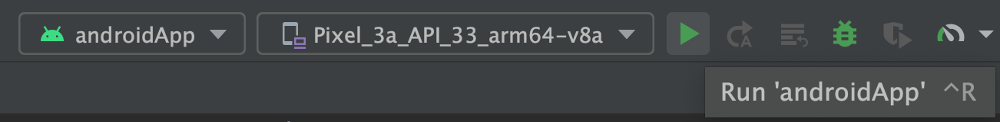
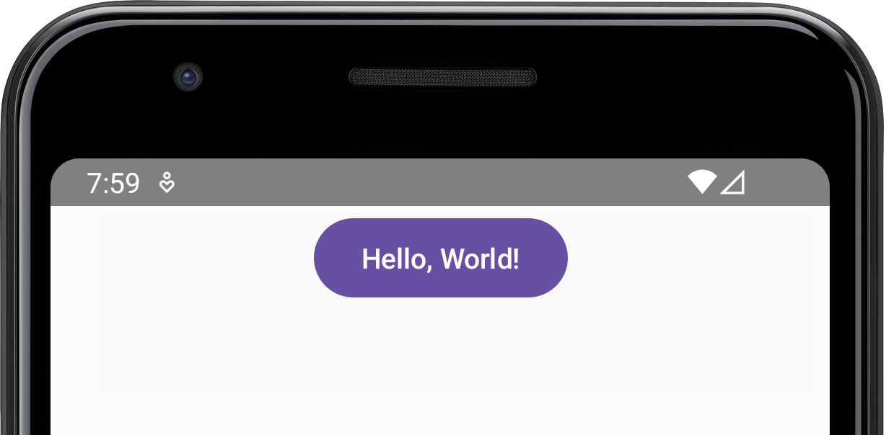
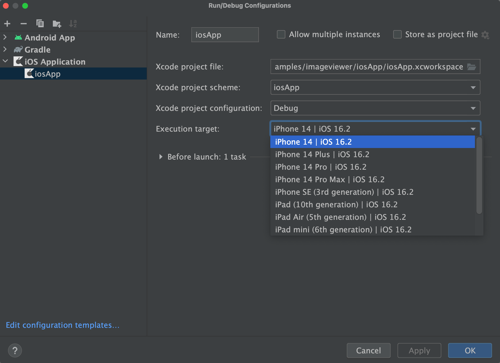
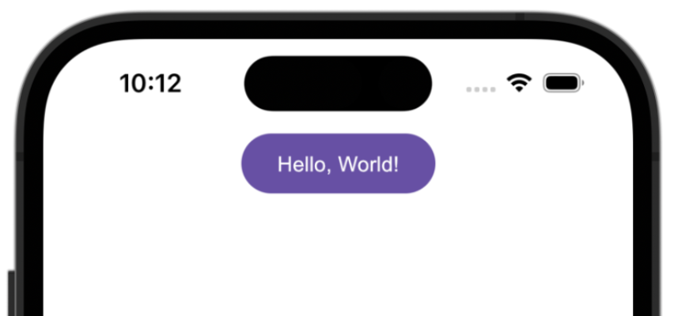
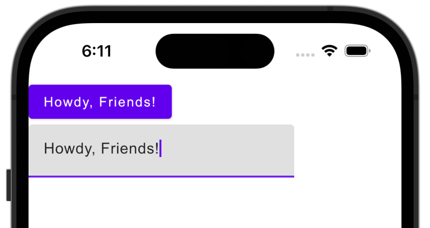

[](https://confluence.jetbrains.com/display/ALL/JetBrains+on+GitHub)
[](https://opensource.org/licenses/Apache-2.0)
# [Compose Multiplatform](https://github.com/JetBrains/compose-multiplatform) mobile application

> **Note**
> Compose Multiplatform for iOS is in Alpha. It may change incompatibly and require manual migration in the future.
> We would appreciate your feedback on it in the public Slack channel [#compose-ios](https://kotlinlang.slack.com/archives/C0346LWVBJ4/p1678888063176359).
> If you face any issues, please report them on [GitHub](https://github.com/JetBrains/compose-multiplatform/issues).

You can use this template to start developing your own [Compose Multiplatform](https://github.com/JetBrains/compose-multiplatform#readme) mobile application targeting Android and iOS.
Follow our tutorial below to get your first Compose Multiplatform app up and running.
The result will be a [Kotlin Multiplatform](https://kotlinlang.org/docs/multiplatform.html) project that uses Compose Multiplatform UI framework.


If you want to create an application targeting desktop platforms – Windows, macOS, and Linux,
use the [Compose Multiplatform for Desktop template](https://github.com/JetBrains/compose-multiplatform-desktop-template#readme).

## Set up the environment

> **Warning**
> You need a Mac with macOS to write and run iOS-specific code on simulated or real devices.
> This is an Apple requirement.

To work with this template, you need the following:

* A machine running a recent version of macOS
* [Xcode](https://apps.apple.com/us/app/xcode/id497799835)
* [Android Studio](https://developer.android.com/studio)
* [Kotlin Multiplatform Mobile plugin](https://plugins.jetbrains.com/plugin/14936-kotlin-multiplatform-mobile)
* [CocoaPods dependency manager](https://kotlinlang.org/docs/native-cocoapods.html)

### Check your environment

Before you start, use the [KDoctor](https://github.com/Kotlin/kdoctor) tool to ensure that your development environment is configured correctly:

1. Install KDoctor with [Homebrew](https://brew.sh/):

    ```text
    brew install kdoctor
    ```

2. Run KDoctor in your terminal:

    ```text
    kdoctor
    ```

   If everything is set up correctly, you'll see a valid output:
   
   ```text
   Environment diagnose (to see all details, use -v option):
   [✓] Operation System
   [✓] Java
   [✓] Android Studio
   [✓] Xcode
   [✓] Cocoapods
   
   Conclusion:
     ✓ Your system is ready for Kotlin Multiplatform Mobile Development!
   ```
   
   Otherwise, KDoctor will highlight which parts of your setup still need configuration and suggest how to fix them.

## Examine the project structure

Open the project in Android Studio and switch the view from **Android** to **Project** to see all the files and targets belonging to the project:


Your Compose Multiplatform project includes three modules:

### shared

This is a Kotlin module that contains the logic common for both Android and iOS applications, the code you share between platforms.

This `shared` module is also where you write your Compose Multiplatform code.
In `shared/src/commonMain/kotlin/App.kt`, you can find the shared root `@Composable` function for your app.

It uses Gradle as the build system. You can add dependencies and change settings in `shared/build.gradle.kts`.
The `shared` module builds into an Android library and an iOS framework.

### androidApp

This is a Kotlin module that builds into an Android application. It uses Gradle as the build system.
The `androidApp` module depends on and uses the `shared` module as a regular Android library.

### iosApp

This is an Xcode project that builds into an iOS application.
It depends on and uses the `shared` module as a CocoaPods dependency.

## Run your application

### On Android

To run your application on an Android emulator:

1. Ensure you have an Android virtual device available. Otherwise, [create one](https://developer.android.com/studio/run/managing-avds#createavd).
2. In the list of run configurations, select `androidApp`.
3. Choose your virtual device and click **Run**:

   
   
   

<details>
  <summary>Alternatively, use Gradle</summary>

To install an Android application on a real device Android device or an emulator, run `./gradlew installDebug` in the terminal.

</details>

### On iOS

#### Running on a simulator

To run your application on an iOS simulator in Android Studio, modify the `iosApp` run configuration:

1. In the list of run configurations, select **Edit Configurations**:

   

2. Navigate to **iOS Application** | **iosApp**.
3. In the **Execution target** list, select your target device. Click **OK**:

   

4. The `iosApp` run configuration is now available. Click **Run** next to your virtual device:



#### Running on a real device

You can run your Compose Multiplatform application on a real iOS device for free.
To do so, you'll need the following:

* `TEAM_ID` associated with your [Apple ID](https://support.apple.com/en-us/HT204316)
* The iOS device registered in Xcode

> **Note** 
> Before you continue, we suggest creating a simple "Hello, world!" project in Xcode to ensure you can successfully run apps on your device.
> You can follow the instructions below or watch this [Stanford CS193P lecture recording](https://youtu.be/bqu6BquVi2M?start=716&end=1399).

<details>
<summary>How to create and run a simple project in Xcode</summary>

1. On the Xcode welcome screen, select **Create a new project in Xcode**.
2. On the **iOS** tab, choose the **App** template. Click **Next**.
3. Specify the product name and keep other settings default. Click **Next**.
4. Select where to store the project on your computer and click **Create**. You'll see an app that displays "Hello, world!" on the device screen.
5. At the top of your Xcode screen, click on a device name near the **Run** button.
6. Plug in your device to the computer. You'll see this device in the list of run options.
7. Choose your device and click **Run**.

</details>

##### Finding your Team ID

In the terminal, run `kdoctor --team-ids` to find your Team ID.
KDoctor will list all Team IDs currently configured on your system, for example:

```text
3ABC246XYZ (Max Sample)
ZABCW6SXYZ (SampleTech Inc.)
```

<details>
<summary>Alternative way of finding your Team ID</summary>

If KDoctor doesn't work for you, try this alternative method:

1. In Android Studio, run the `iosApp` configuration with the selected real device. The build should fail.
2. Go to Xcode and select **Open a project or file**.
3. Navigate to the `iosApp/iosApp.xcworkspace` file of your project.
4. In the left menu, select `iosApp`.
5. Navigate to **Signing & Capabilities**.
6. In the **Team** list, select your personal team.

   If you haven't set up your team yet, use the **Add account** option and follow the steps.

</details>

To run the application, set the `TEAM_ID`:

1. In the template, navigate to the `iosApp/Configuration/Config.xcconfig` file.
2. Set your `TEAM_ID`.
3. Re-open the project in Android Studio. It should show the registered iOS device in the `iosApp` run configuration.

## Make your first changes

You can now make some changes in the code and see that they will be visible in both iOS and Android applications at once:

1. In Android Studio, navigate to the `shared/src/commonMain/kotlin/App.kt` file.
   It's the common entry point for your Compose Multiplatform app. 
   
   Here, you see the code responsible for rendering the "Hello, World!" button and the animated Compose Multiplatform logo:

   ```kotlin
   @OptIn(ExperimentalResourceApi::class)
   @Composable
   fun App() {
       MaterialTheme {
           var greetingText by remember { mutableStateOf("Hello, World!") }
           var showImage by remember { mutableStateOf(false) }
           Column(Modifier.fillMaxWidth(), horizontalAlignment = Alignment.CenterHorizontally) {
               Button(onClick = {
                   greetingText = "Hello, ${getPlatformName()}"
                   showImage = !showImage
               }) {
                   Text(greetingText)
               }
               AnimatedVisibility(showImage) {
                   Image(
                       painterResource("compose-multiplatform.xml"),
                       null
                   )
               }
           }
       }
   }
   ```

2. Update the shared code by adding a text field that will update the name displayed on the button:

   ```diff
   @OptIn(ExperimentalResourceApi::class)
   @Composable
   fun App() {
       MaterialTheme {
           var greetingText by remember { mutableStateOf("Hello, World!") }
           var showImage by remember { mutableStateOf(false) }
           Column(Modifier.fillMaxWidth(), horizontalAlignment = Alignment.CenterHorizontally) {
               Button(onClick = {
                   greetingText = "Hello, ${getPlatformName()}"
                   showImage = !showImage
               }) {
                   Text(greetingText)
               }
   +           TextField(greetingText, onValueChange = { greetingText = it })
               AnimatedVisibility(showImage) {
                   Image(
                       painterResource("compose-multiplatform.xml"),
                       null
                   )
               }
           }
       }
   }
   ```

3. Re-run both `androidApp` and `iosApp` configurations. You'll see this change reflected in both the Android and iOS apps:

   

## How to configure the iOS application

To get a better understanding of this template's setup and learn how to configure the basic properties of your iOS app without Xcode,
open the `iosApp/Configuration/Config.xcconfig` file in Android Studio. The configuration file contains:

* `APP_NAME`, a target executable and an application bundle name
* `BUNDLE_ID` that [uniquely identifies the app throughout the system](https://developer.apple.com/documentation/bundleresources/information_property_list/cfbundleidentifier#discussion)
* `TEAM_ID`, [a unique identifier generated by Apple that's assigned to your team](https://developer.apple.com/help/account/manage-your-team/locate-your-team-id/#:~:text=A%20Team%20ID%20is%20a,developer%20in%20App%20Store%20Connect)

To configure the `APP_NAME` option, open `Config.xcconfig` in any text editor *before opening* the project in Android Studio and set the desired name.

If you need to change this option after you open the project in Android Studio, do the following:

1. Close the project in Android Studio.
2. Run `./cleanup.sh` in your terminal.
3. Change the setting.
4. Open the project in Android Studio again.

To configure advanced settings, use Xcode. After opening the project in Android Studio,
go to Xcode and open the `iosApp/iosApp.xcworkspace` file, and make changes.

## Next steps

We encourage you to explore Compose Multiplatform further and try out more projects:

* [Learn about other cases where you can use the Compose Multiplatform UI framework](https://github.com/JetBrains/compose-multiplatform#readme)
* [Create an application targeting Windows, macOS, and Linux with Compose Multiplatform for Desktop](https://github.com/JetBrains/compose-multiplatform-desktop-template#readme)
* [Complete more Compose Multiplatform tutorials](https://github.com/JetBrains/compose-multiplatform/blob/master/tutorials/README.md)
* [Explore some more advanced Compose Multiplatform example projects](https://github.com/JetBrains/compose-multiplatform/blob/master/examples/README.md)
